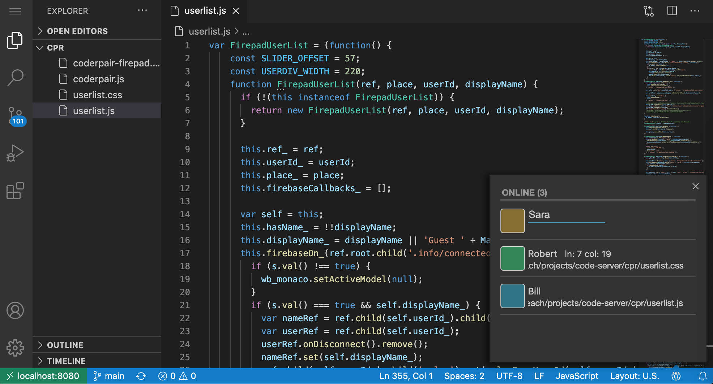

# Coderpair vscode-live

Run [VS Code](https://github.com/Microsoft/vscode) on any machine anywhere and access it in the browser.

Set up multiple user accounts. Each user may have their own preferences/settings.

Collaborate with your team in real-time.


*Use the group icon in the statusbar to open the user list.

## What is this?

This is a modified version of [code-server's](https://github.com/cdr/code-server) release of vscode.
You basically get the full vscode editor running in your browser, plus the added features mentioned above.

The real-time collaboration feature adds functionality similar to what you find in Microsoft's Live Share extension. One big difference, however, is that you don't have to invite people to share. Once you turn on this feature, you get true peer to peer collaboration. Everyone who connects to the vscode server is connected to the same codebase as peers, and they may edit, collaborate, and generally come and go as they please. Another difference between this and Live Share is that there is, at the moment, no shared terminal or debugging session. 

Unfortunately, this is NOT a vscode extension. This is a full port of vscode, and thus cannot be simply plugged in to an existing installation.

## Getting Started

Almost all the info that you need can be found on the [code-server](https://github.com/cdr/code-server) page. The only thing that will be covered here are the differences.

## Installing

Get the latest release [here](https://github.com/coderpair/vscode-live/releases). Refer to [code-server's standalone instructions](https://github.com/cdr/code-server/blob/v3.7.3/doc/install.md#standalone-releases) for manual installation on your particular environment.

## Setup

Run code-server according to the instructions in the installation page above and point your browser to the url of your code-server installation. If everything looks OK, you are ready to start setting up vscode-live.

When `code-server` starts up, it creates a default config file in `~/.config/code-server/config.yaml` that looks
like this:

```yaml
bind-addr: 127.0.0.1:8080
auth: password
password: mewkmdasosafuio3422 # This is randomly generated for each config.yaml
admin: osdifnasdfiopsdfn3556 # This is randomly generated for each config.yaml
cert: false
```

The `password` field is what you use to log in to code-server as the default user. 

`admin` is a secondary password that you use for making changed through the dashboard.

## Setting up Firebase
You will need a Firebase account to use the real time collaboration feature. You can [sign up here for a free account](https://console.firebase.google.com/).

After signing up, edit the `config.yaml` so that it looks like this:

```yaml
bind-addr: 127.0.0.1:8080
auth: password
password: mewkmdasosafuio3422 # This is randomly generated for each config.yaml
admin: osdifnasdfiopsdfn3556 # This is randomly generated for each config.yaml
cert: false
firebase-apiKey: '<API_KEY>'
firebase-authDomain: '<DATABASE_NAME>.firebaseapp.com'
firebase-databaseURL: 'https://<DATABASE_NAME>.firebaseio.com'
firebase-ref: '-MCyz2LOkxQUSJBASlcG'
```

Fill in the `<API_KEY>` and `<DATABASE_NAME>` with your Firebase settings. You can leave the `firebase-ref` field as is or change it if you feel like it! Restart code-server for the changes to go into effect.

Skip to [Turning on real time collaboration](#turning-on-real-time-collaboration) if you don't want to set up multiple accounts.

## Setting up multiple accounts

You can set up an account for each of your team members. Each user will be able to use vscode-live with their own default settings.

In order to set up multiple accounts, add a `users` field to the  `config.yaml` file so that it looks like this:

```yaml
bind-addr: 127.0.0.1:8080
auth: password
password: mewkmdasosafuio3422 # This is randomly generated for each config.yaml
admin: osdifnasdfiopsdfn3556 # This is randomly generated for each config.yaml
cert: false
firebase-apiKey: '<API_KEY>'
firebase-authDomain: '<DATABASE_NAME>.firebaseapp.com'
firebase-databaseURL: 'https://<DATABASE_NAME>.firebaseio.com'
firebase-ref: '-MCyz2LOkxQUSJBASlcG'
users: {
  robert: {password: pswd1, role: admin},
  sara: {password: pswd2, role: user},
  leonardo: {password: pswd3, role: user}
}
```

Restart code-server for the changes to go into effect.

You can add as many accounts as you like. You will log in to code-server with password you specify, so make sure it is a secure password.

Go to the login page in your browser

ie http://localhost:8080/login  

and sign in with one of the user accounts.

## Turning on real time collaboration

Head over to the dashboard:

ie http://localhost:8080/dashboard  

go to the real time collaboration section, and turn it on there. Make sure you use the `admin` password in the config file to make changes.

Have fun!


